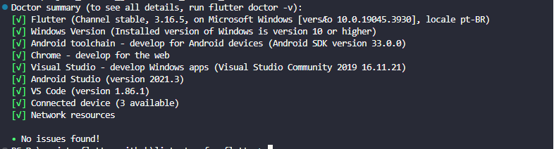

# App de Acessórios diário

Aplicação criada em Flutter,  
com o propósido de estudo do framework. 
A princípio ele irá conter:  
 - Lista de Tarefas com ordenação de prioridades, exclusão e edição. 
 - Pomodoro. 
 - Agenda com compromissos mensais, que deve notificar mesmo com o app fechado. 
 - Carregamento de dados offline. 
 - No Dashboard, ao logar e permitir acesso a localização do Dispositivo trazer dados meteorológicos. 

## Para iniciar a aplicação.

Antes de clonar a aplicação, certifique-se de ter instalado o flutter na versão correta. 
Rode o comando "flutter doctor" no prompt de comando e verifique se está tudo ok. 

Clonar o repositório 
Abrir no vsCode e rodar no terminal o comando "flutter run", dentro da pasta do projeto. 
Ao clonar, pode acontecer de o projeto dar erro. Nesse caso limpe os pacotes com "flutter clean" e em seguida os recupere com "flutter pub get".  
Após isso a aplicação deve rodar sem problemas. =)
